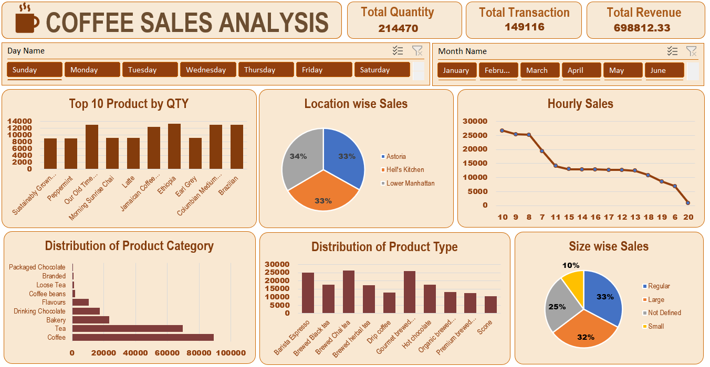

# COFFEE SALES ANALYSIS

_A data-driven project using Excel tools to analyze coffee sales, identify trends, and improve business decisions.

## TAble of content
- <a href="#overview">Overview</a>
- <a href="#business-problem">Business Problem</a>
- <a href="#dataset">Dataset</a>
- <a href="#tools--tecgnologies">Tools and Technologies</a>
- <a href="#project-structure">Project Structure</a>
- <a href="#data-cleaning--prepration">Data Cleaning and Preprations</a>
- <a href="#research-questions--key-findings">Research Questions and Key Findings</a>
- <a href="#dashboard">Dashboard</a>
- <a href="#how-to-run-this-project">How To Run This Project</a>
- <a href="#final-recomendations">Final Recomendations</a>
- <a href="#author--contact">Author and Contact</a>


<h2><a class="anchor" id="overview"></a>Overview</h2>

“Coffee Sales Analysis using Excel” project helps visualize and understand sales performance through data charts and dashboards. It identifies trends, top-selling products, and customer preferences for better business decisions.


---
<h2><a class="anchor" id="business-problem"></a>Business Problem</h2>

Effective sales tracking and performance analysis are critical in coffee shop sales. This project aims to:
-Identify top-performing and underperforming coffee products.
-Analyze location-wise and hourly sales trends.
-Determine revenue contributions by product type and size.
-Understand customer preferences to improve marketing strategies.
-Optimize inventory based on product demand and sales patterns.
-Support data-driven decisions to enhance overall shop profitability.

---

<h2><a class="anchor" id="dataset"></a>Dataset</h2>

Data file located in  `data` folder.
-Dataset Details
-*Number of Records: 149117
-*Number of Features/Columns: 11
-*Data Format: CSV

---

<h2><a class="anchor" id="tools--tecgnologies"></a>Tools and Technologies</h2>

- MicroSoft Excel
- GitHub

---

<h2><a class="anchor" id="project-structure"></a>Project Structure</h2>
...
coffee-sales-analysis/
├── README.md  
├── .gitignore  
├── requirements.txt  
├── Coffee Sales Report.pdf  

├── dashboard/              
│   └── coffee_sales_dashboard.xlsx
...

---

<h2><a class="anchor" id="data-cleaning--preprations"></a>Data Cleaning and POreprations</h2>

- Removed extra and repeated rows from the data.
- Filled or removed missing values in sales and quantity columns.
- Made product names, sizes, and location names uniform.
- Changed date and time into proper format for easy analysis.
- Added new columns for month, day, and hour to study trends.
- Combined all data into one clean and organized sheet.
- Checked total quantity, transactions, and revenue to make sure data is correct.

---


<h2><a class="anchor" id="research-questions--key-findings"></a>Research Questions and Key Findings</h2>

Research Questions:
- Which coffee products are sold the most and the least?
- Which shop location has the highest and lowest sales?
- At what time of the day do most sales happen?
- Which product type and size earn the most revenue?
- How do sales change across different days and months?

Key Findings:
- Top-selling products include Brewed Coffee, Premium, and Espresso items.
- Astoria location has the highest total sales among all branches.
- Morning hours (8 AM – 11 AM) show maximum customer activity.
- Regular and Large sizes are the most preferred by customers.
- Coffee and Tea categories generate the highest revenue.
- Sunday and Monday record better sales compared to other weekdays.
- Some products and time slots show low performance and need attention.

---

<h2><a class="anchor" id="dashboard"></a>Dashboard</h2>

- Excel dashboard shows:
| - Total Sales and Profit overview  
| - Category-wise performance chart 
| - Average sales per month 
| - Dynamic filters and slicers for easy analysis
| - Customer purchase insights 



---

<h2><a class="anchor" id="how-to-run-this-project"></a>How To Run This Project</h2>

1. Download the Repository  
   - Click on the green “Code” button and download as ZIP, or clone using:  
     ```bash
     git clone <repository-url>
     ```

2. Open Dataset
   - Navigate to the `data` folder and open the Excel file.

3. Open Dashboard
   - Open the Excel dashboard file  
   - Make sure macros are enabled if any are used.

4. Explore Analysis 
   - Use the slicers and filters to explore different time periods, products, or regions.  
   - Charts and KPIs will update automatically based on your selection.

5. Optional – Modify or Update Data 
   - Update the dataset file to see changes reflected in the dashboard instantly.

---

<h2><a class="anchor" id="final-recomendations"></a>Final Recomendations</h2>

- Focus on top-performing products or categories for maximum revenue  
- Monitor monthly and regional sales trends regularly  
- Use dashboard insights for strategic decision-making  
- Update dataset frequently to maintain accuracy  
- Implement promotions during peak sales months  
- Leverage interactive dashboard for quick business analysis

---

<h2><a class="anchor" id="author--contact"></a>Author and Contact</h2>

Sadiya
Email: sadiyahaldwani413@gmail.com
GitHub: https://github.com/Sadiya6767
Linkedin: www.linkedin.com/in/sadiya-ansari-0002b8291

---